# AIVision 开发平台（AIP）使用文档

## 多阶段任务子平台

### 功能介绍

多阶段任务平台是涵盖了目标检测、图像分类等常见深度学习任务的在线实验平台，主要面向非深度学习背景和专业的用户。在平台上用户通过简单的绘制流程图的方式，确定并连接任务的各个节点，同时为每个节点选择合适的模型并配置参数，并通过平台提供的服务器快速创建并训练多阶段任务的模型（当然也支持一般的单阶段任务）。


该多阶段任务系统的核心思想是**每一个阶段都使用上一阶段产出的结果作为训练数据**，以此来模拟真实使用场景下的数据传递。

### 主要组件

- 数据集：上传及管理功能由炼知平台提供
- 子任务：单独的检测，分类等任务
- 流程图：即多阶段任务，包含个若干个子任务（如检测+分类）
- 标注系统：开源的 Dataturks 标注系统，支持检测、图像分类、图像分割、命名实体识别、文本分类等常见任务标注
- 模型：管理训练好的子任务模型

### 支持的子任务类型

- 图像分类：已完成
- 目标检测：已完成，容器环境自动配置目前仍有问题
- 文本识别：已完成
- 图像分割：已完成，容器环境自动配置目前仍有问题
- 文本检测：已完成
- 视频动作识别：开发中
- 图像增强类（image2image）：如图像去模糊，去褶皱，去印章，去阴影，去雨去雾等 已完成
- 自然语言处理相关任务： 规划

### 快速开始

以检测+分类为例：

#### 上传业务数据

提前上传好原始数据集，按规定格式打包成 zip 后，在数据集页面上传


##### 无标注的任务

无标注的任务只有图片

文件目录结构如下：

```
dataset_dir/
			1.jpg
			2.jpg
			...
```

_以下均为有标注的任务。_

##### 分类任务

在数据集目录下，每个目录名代表一种类别，该目录下的所有图片均为同类别(即目录名)

eg:类别包括 cat,dog,sheep

文件目录结构如下：

```
dataset_dir/
            cat/
                cat1.jpg
                cat2.jpg
                ...
            dog/
                dog1.jpg
                dog2.jpg
                ...
            sheep/
                sheep1.jpg
                sheep2.jpg
                ...
```

##### 目标检测（矩形）

文件目录结构如下：

```
dataset_dir/
			1.jpg
			2.jpg
			...
			label.txt
```

其中 label.txt 中的格式如下：

```
path,width,height
num
xmin,ymin,xmax,ymax
label/text
```

注：path 表示图片的相对路径，如：1.jpg

width,height 均为整数，表示图片的宽、高

num 表示有几个检测框，则下面就会有个成对的标注

xmin，ymin,xmax,ymax 表示检测框中的左上角以及右下角的坐标中横坐标及纵坐标的最大最小值。

label/text 表示检测框中的类别或者文本识别信息

eg:

```
1.jpg,100,200
3
1,1,10,10
cy
13，13，28，29
yc
30,40,50,60
cycycycy
2.jpg,200,250
1
2,3,19,23
text
....
```

##### 文本检测（矩形）

文件目录结构如下：

```
dataset_dir/
			1.jpg
			2.jpg
			...
			label.txt
```

其中 label.txt 中的格式如下：

```
path,width,height
num
xmin,ymin,xmax,ymax
label/text
```

注：path 表示图片的相对路径，如：1.jpg

width,height 均为整数，表示图片的宽、高

num 表示有几个检测框，则下面就会有个成对的标注

xmin，ymin,xmax,ymax 表示检测框中的左上角以及右下角的坐标中横坐标及纵坐标的最大最小值。

label/text 表示检测框中的类别或者文本识别信息

eg:

```
1.jpg,100,200
3
1,1,10,10
cy
13，13，28，29
yc
30,40,50,60
cycycycy
2.jpg,200,250
1
2,3,19,23
text
....
```

##### 文本检测(多边形)

文件夹格式同上

```
dataset_dir/
			1.jpg
			2.jpg
			...
			label.txt
```

label.txt 中格式与上类似，主要区别在于记录检测框的方式变成**顺时针**遍历的坐标，注意不需要首位坐标重复

```
path,width,height
num
(x1,y1),(x2,y2),(x3,y3),...(xn,yn)
label/text
```

##### 图像分割(多边形)

文件夹格式同上:

```
dataset_dir/
			1.jpg
			2.jpg
			...
			label.txt
```

label.txt 中格式与上类似，主要区别在于记录检测框的方式变成**顺时针**遍历的坐标，注意不需要首位坐标重复，**只需要给出前景物体的标注**

```
path,width,height
num
(x1,y1),(x2,y2),(x3,y3),...(xn,yn)
label/text
```

##### 文本识别

文件夹格式同上:

```
dataset_dir/
			1.jpg
			2.jpg
			...
			label.txt
```

其中 label.txt 中的格式如下：

```
path,text
```

eg:

```
1.jpg,cycyc
2.jpg,cycycyyc
```

##### 增强任务

文件夹格式如下：

其中确保 input 和 target 中的图片名称**一一对应**，并已经**分好训练集和测试集**。

```
dataset_dir/
            train/
                input/
                    a.jpg
                    b.jpg
                target/
                    a.jpg
                    b.jpg
            test/
                input/
                    c.jpg
                target/
                    c.jpg
```

上传完成后，在我的数据集中会看到该数据集

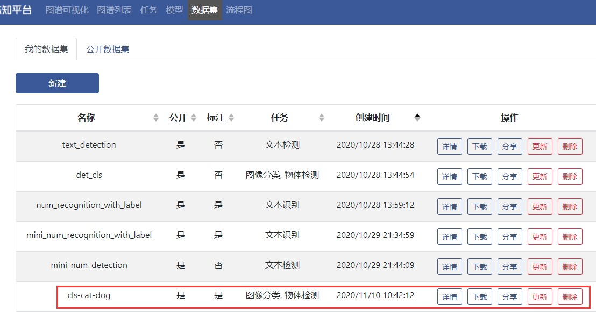

#### 快速定制任务

进入流程图界面，点击页面最下方的新建按钮，输入流程图名


绘制任务流程图，数据集节点需要连向第一个需要该数据集的任务节点，由于该任务是细粒度检测+识别，那么实际上针对粗类别 cat 和 dog，细分类任务模型需要分别训练，体现在流程图上就需要绘制两个图像分类节点


配置每个流程图节点的具体参数并上传

**配置数据集节点**：选择刚才上传的那个原始数据集，并点击右侧的保存属性


**配置目标检测任务节点**：点击右侧按钮打开任务配置界面，在选择模型后会出现详细参数的设置。如果第一次使用，那么选择重新训练，设置运行参数（默认也可），同时选择可选的预训练模型（加快训练速度），输入（细）类别（cat,dog）,设置公开属性，设置完成后如下图，点击下方保存


如果是第二次使用这个模型节点，并且目的相同，那么可以选择直接使用已经训练好的模型（如果第一步选择了公开，那么其他用户使用该模型训练的参数也会出现在备选列表中），这个节点不需要重新训练，但同时类别也不再允许更改


**配置图像分类任务节点**，与上一步类似，需要注意的是，目前创建的任务属于细粒度检测+识别，因此需要输入该细粒度识别模型对应的粗类别，比如 cat（**属于检测任务的一个细类别**），然后输入不同的 cat 细类别，在另一个分类节点中也一样


点击右上角下载参数可以下载本次设置的参数；**点击右上角的上传可以创建任务**

#### 自动串行训练

查看流程图任务状态，在已创建的流程图页面点击刚才创建的流程图可以进入到该流程图的状态页面


该流程图各个节点的进度信息会以特殊颜色展示，红色节点表示正在进行当中，用户需要进入确认；绿色节点表示当前节点已经完成；而默认的蓝色节点则表示还未进行到该任务节点

下图中的各个任务节点都已经完成训练

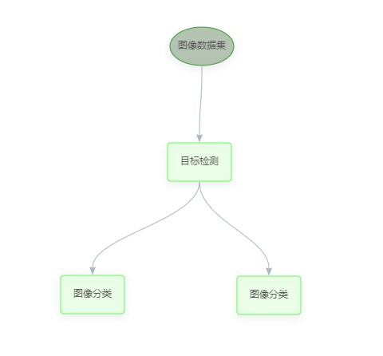

**双击一个任务节点**，可以进入到这个任务节点单独的管理界面，在刚创建任务的情况下，如果使用的数据集没有预先标注，用户需要先进行数据标注，点击【去标注】后，用户会前往 Dataturks 标注系统进行数据标注

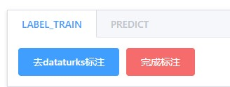

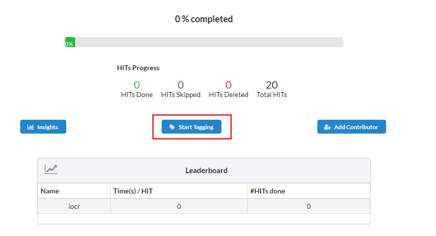

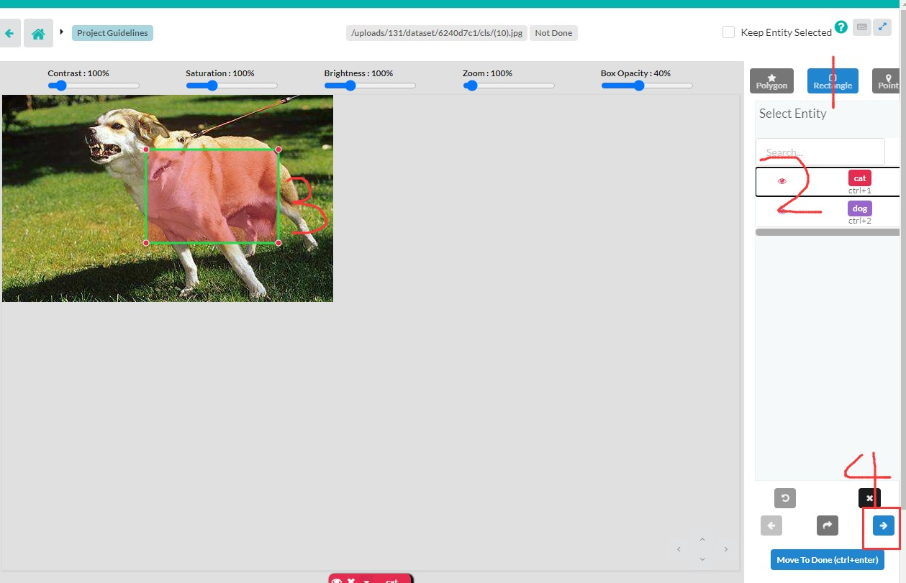

按上图中的步骤标注完所有图片后返回刚才的任务管理界面，点击【完成标注】，页面自动刷新后任务即开始正式的训练，后续进入该任务节点可以查看这个节点更具体的训练信息，如日志、训练阶段、各类训练指标

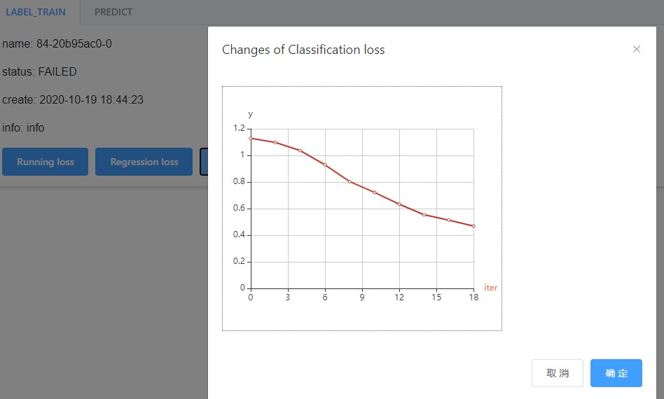

#### 本地一键部署

用户的流程图在训练完成后，进入【流程图】页面，选择【表格一览】标签，可以看到以表格形式呈现的所有流程图。点击【下载 AIP 通用镜像】可以下载已经配置好了所需环境的容器镜像，可用于后续所有本平台模型的本地部署。

对于训练好的流程图模型，点击右侧下载图标可以下载 zip 格式的压缩包到本地，参考下方的本地部署指令即可实现在本地运行一个 HTTP 服务。

下载解压后在本目录下运行./deploy.sh 1.x,稍等片刻即可通过宿主机 10086 端口访问服务，向<http://127.0.0.1:10086/aip>发送请求即可获得结果

**本地部署指令**

```bash
aaa
bbb
ccc
```

**本地 HTTP 调用方式**

POST /aip

\# request

```json
{
  "image": base64_str
}
```

| 字段名 | 字段类型 | 备注                                   |
| ------ | -------- | -------------------------------------- |
| image  | string   | base64 字符串表示的图像，大小不超过 4M |

\# response

```json
{
  "code": code,
  "message": message,
  "data": data,
  "time": time
}
```

| 字段名  | 字段类型 | 备注                                                                         |
| ------- | -------- | ---------------------------------------------------------------------------- |
| code    | number   | 200 表示预测成功，400 表示请求参数错误，401 表示预测过程发生错误，请联系支持 |
| message | string   | 信息                                                                         |
| data    | json     | json 格式的数据                                                              |
| time    | string   | 响应时间，如 `2020-12-21 20:26:41`                                           |

**curl**

```bash
curl -H "Content-Type: application/json" -X POST -d '{"image": "base64_str" }' "http://10.214.211.205:12345/aip"
```

**参考资料**

\# Python 将图片路径转为 base64 字符串

```python
import base64
def read_image(image_path):
    with open(image_path, "rb") as image_file:
        encoded_string = base64.b64encode( image_file.read() )
    return encoded_string.decode('utf-8')
```

## 模型炼知子平台

### 功能介绍

炼知平台是基于知识蒸馏、剪枝、知识重组技术构建的在线平台，主要面向非深度学习背景和专业的用户。在平台上用户通过选择合适的模型，并通过平台提供的算法一键构建新模型。

### 主要组件

- 图谱可视化：利用可迁移性度量算法计算得到的模型间相似性图
- 图谱列表：图谱中模型的详细信息，如大小、开源库地址等
- 任务：在线创建训练任务
- 数据集：管理、分享数据集
- 模型：管理、分享模型

### 支持的算法

- **AutoPruning**：对用户给定的 pytorch 模型进行自动剪枝，支持 resnet、densenet 等网络结构。
- **Knowledge Distillation**: 知识蒸馏
- **Layerwise Amalgamation**: 合并多个分类器的重组算法，要求输入分类器同构，适用于数据较少的场景，收敛速度较快。
- **Common Feature Learning**：分类器重组，功能同上，模型可以异构。
- **TaskBranching**：将多个预训练蒸馏到一个自动分杈解码的网络中，支持分割、深度、法向量等任务。

### 快速开始

以剪枝+蒸馏为例：

#### 共享的模型和数据

查看平台上共享的模型和数据

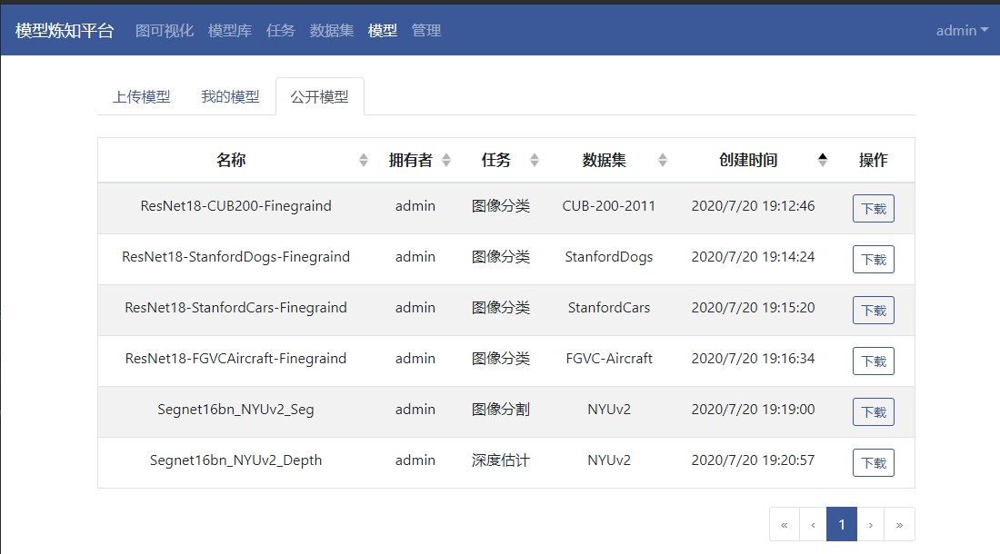

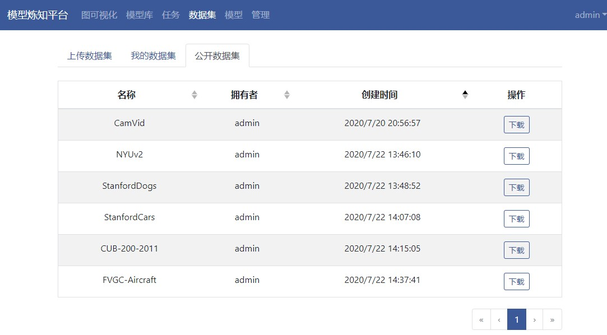

#### 任务界面

进入平台的任务界面，这里选择 AutoPruning 算法\*

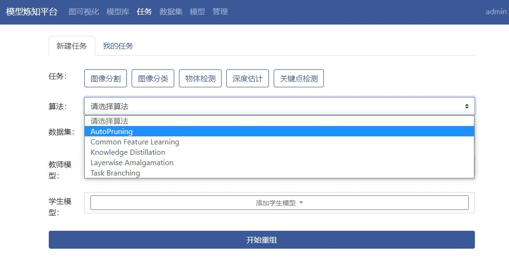

#### 配置训练

选择需要的数据集和教师模型，点击开始重组即可进行训练

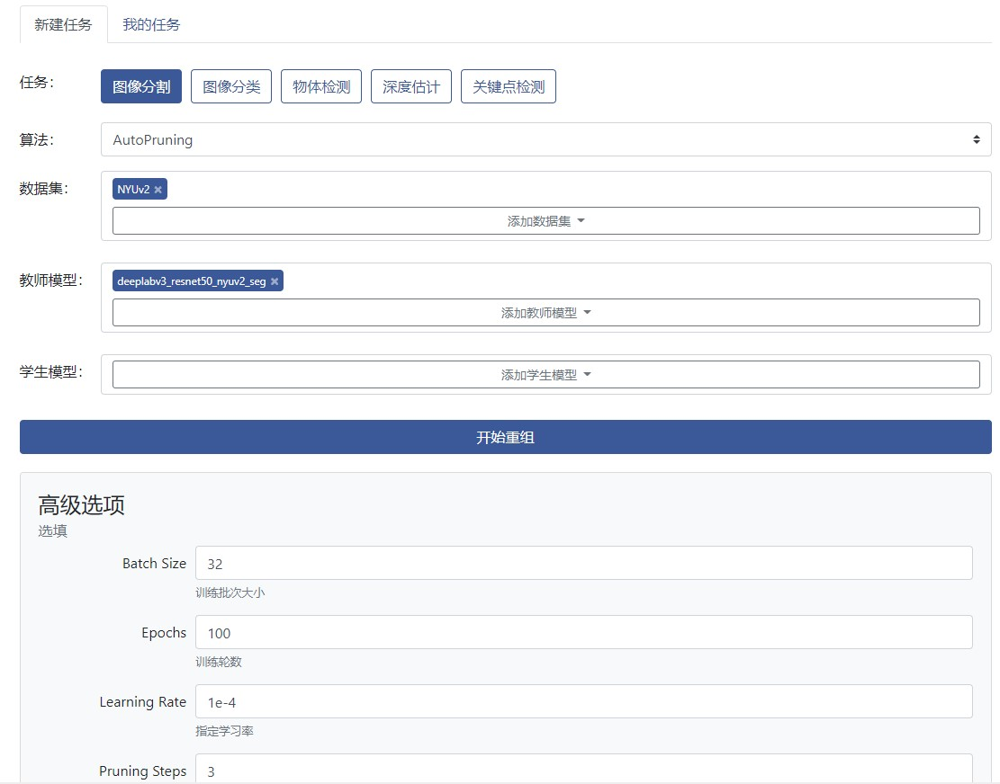

#### 检查训练状态

前往我的任务检查训练状态

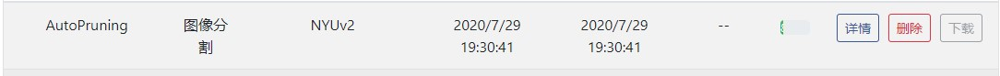

点击详情可查看更具体的训练信息，如日志、训练阶段、各类训练指标

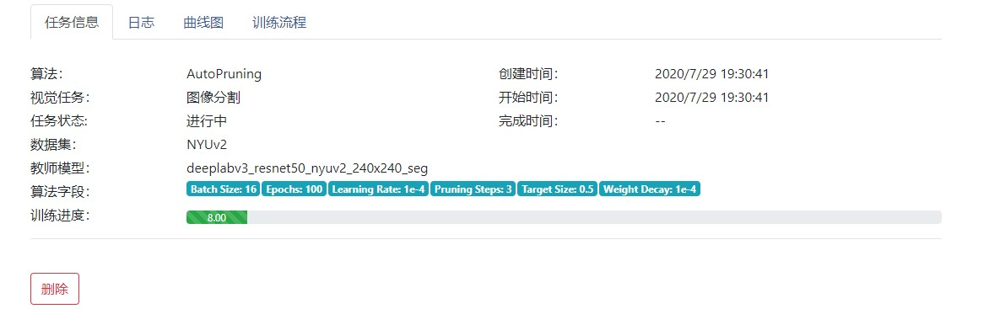

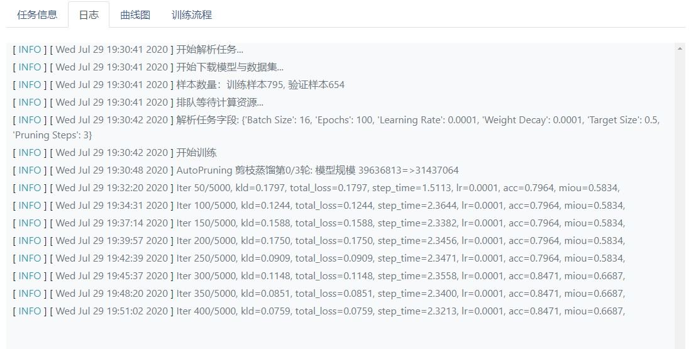

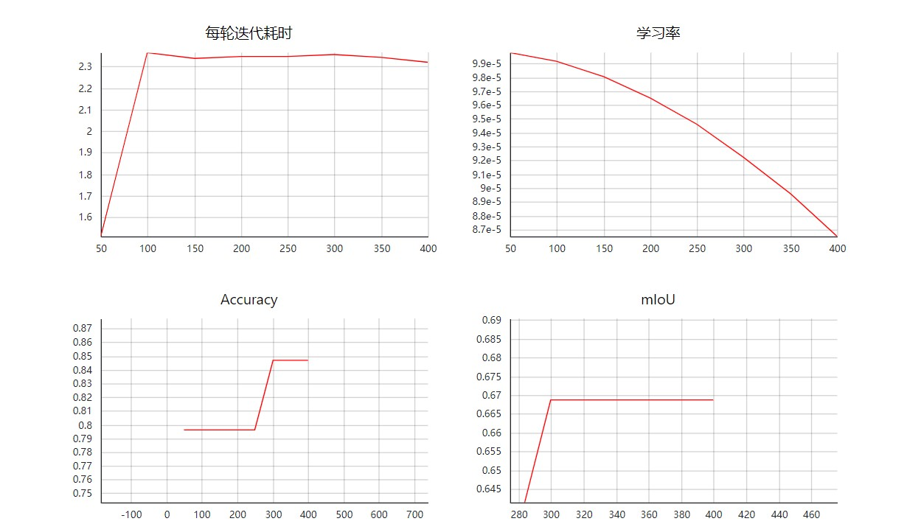

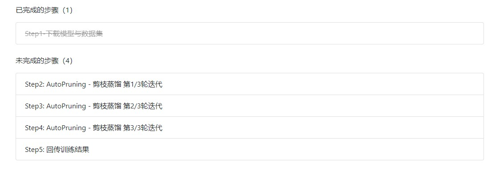

#### 任务完成

任务完成后，模型会被自动存储至我的模型处

### 数据与模型

- 上传数据：数据集为.zip 格式的压缩包，数据集内所有 jpeg、png 图像均被看成训练样本。压缩包中可以包含一个名为 test 的文件夹用于模型测试，若不提供 test 则平台自动切分训练集和验证集。

- 上传模型：平台使用的模型均为 Pytorch 实现，上传的模型需要按照指定格式打包：<https://github.com/zju-vipa/KamalEngine/blob/master/docs/export.md>

### 模型图谱

模型图谱的作用是度量不同模型之间的可迁移性，节点间距离越大表示可迁移性越弱，平台包含两种度量算法：

- AttributionMap：<https://papers.nips.cc/paper/8849-deep-model-transferability-from-attribution-maps.pdf>
- AttributionGraph：<https://arxiv.org/abs/2003.07496>

平台提供不同数据集上的模型图谱作为用户选择模型的参考。

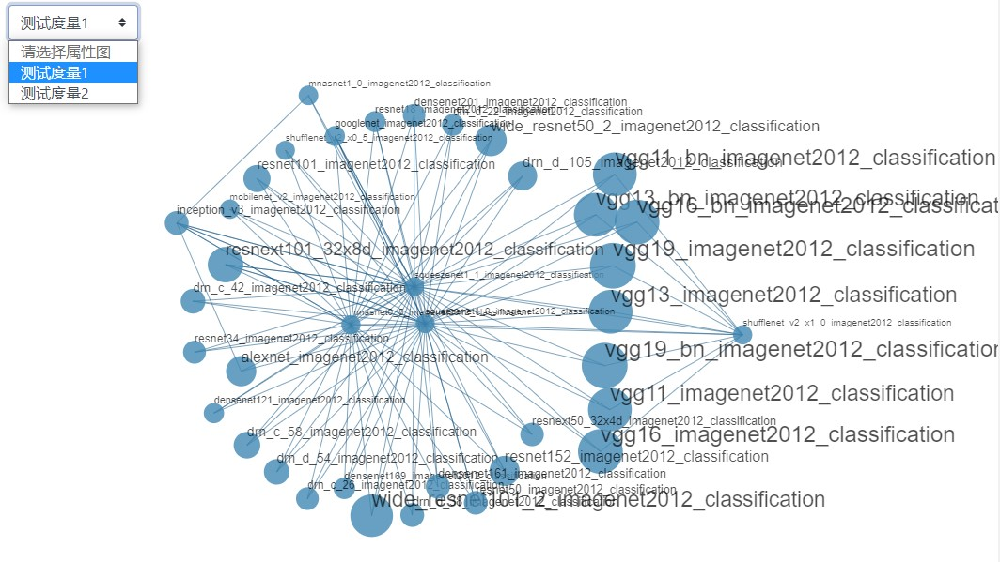

### 详细算法介绍

#### AutoPruning

自动剪枝算法，该算法会根据用户给定的目标模型规模，对输入的模型进行剪枝以及训练，用户可以通过 Target Size 设置剪枝后模型的参数比例，并利用 Pruning Steps 参数来控制剪枝训练的轮数。例设置参数 Target Size=0.5, Pruning Steps=3 时，整个剪枝训练分三阶段，最终输出模型大小为输入模型的 50%。

**运行样例**：剪枝 Deeplabv3_ResNet50 模型

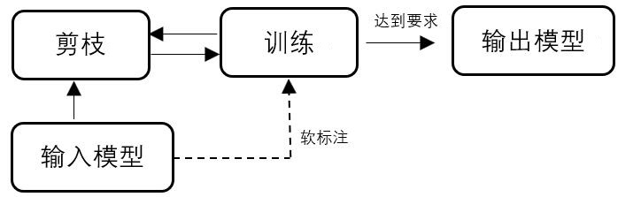

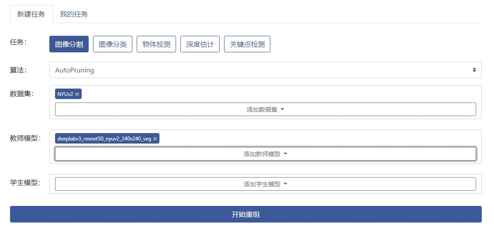

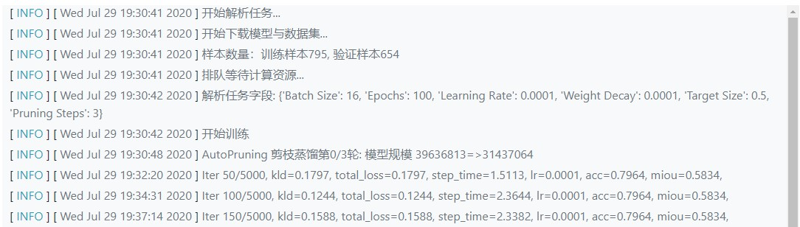

#### Knowledge Distillation

标准的知识蒸馏算法，目前支持分类、分割、深度等网络，并且能够自动根据教师网络的输出调整学生网络的结构。

**运行样例**：在 Stanford Cars 数据集上蒸馏 resnet18

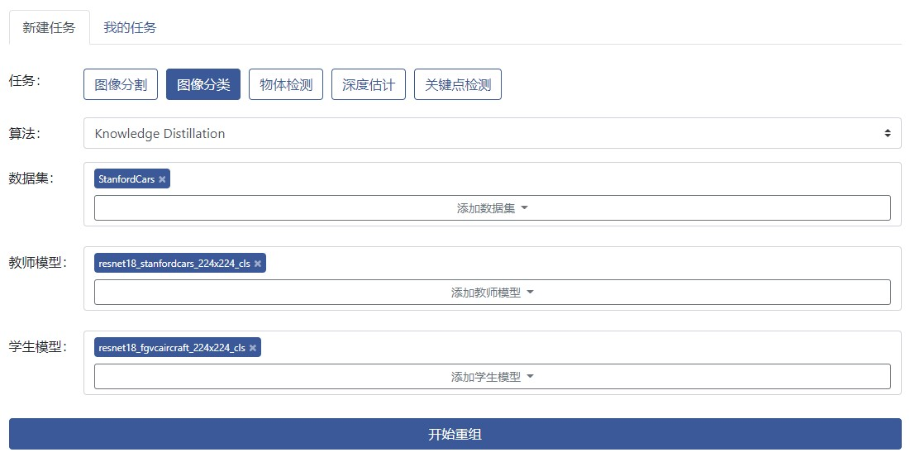

#### Layerwise Amalgamation

逐层的知识重组算法，用于多个分类网络的合并。输入为 1 个及以上的**同构分类器**，输出网络具备所有输入分类器的分类能力。如输入 A, B, C 三个不同的分类器，输出网络将同时具备三者的分类能力，输出类别数为 ABC 类别数之和。

**论文链接**：<https://arxiv.org/abs/1811.02796>

**运行样例**：重组鸟和狗的细粒度分类器

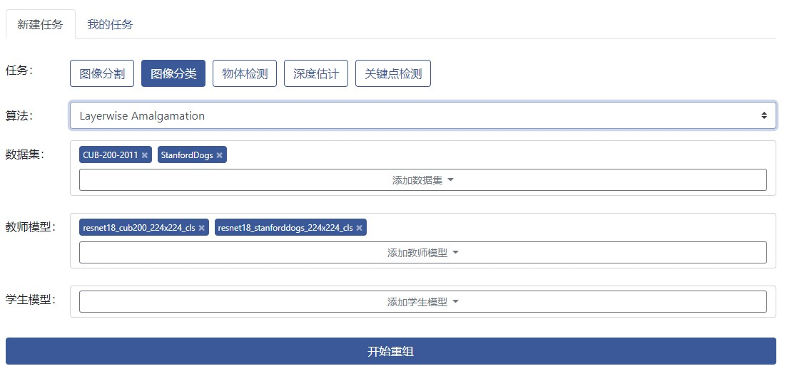

#### Common Feature Learning

共同特征提取算法，用于多个任意结构的分类器重组。输入为 1 个及以上的**同构分类器**，输出网络具备所有输入分类器的分类能力。

**论文链接**：<https://arxiv.org/abs/1906.10546>

**运行样例**：重组鸟和狗的细粒度分类器

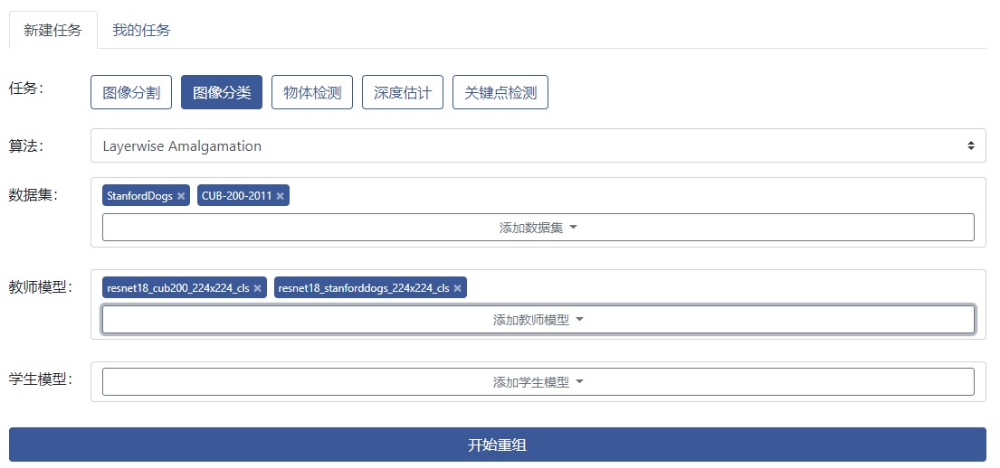

#### Task Branching

用于多任务场景解析的重组算法，其目标是整合多个独立网络学习到的特征，构建一个更轻量的多任务网络，如语义分割+单目深度估计。算法输入为多个场景解析模型，并根据不同分支点的损失函数值自动寻找合适的任务分杈设置。目前输出网络仅支持 SegNet。

**论文链接**：<https://arxiv.org/abs/1904.10167>

**运行样例**：在 NYUv2 数据集上重组语义分割和深度估计网络

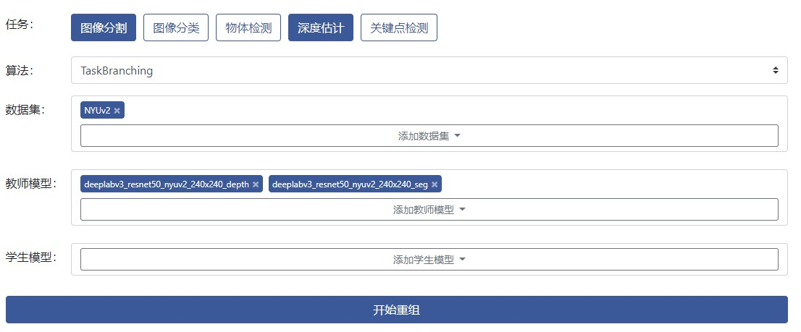

### 进一步了解知识重组

- 平台底层算法库：<https://github.com/zju-vipa/KamalEngine>
- 课题组主页：<https://www.vipazoo.cn/>
