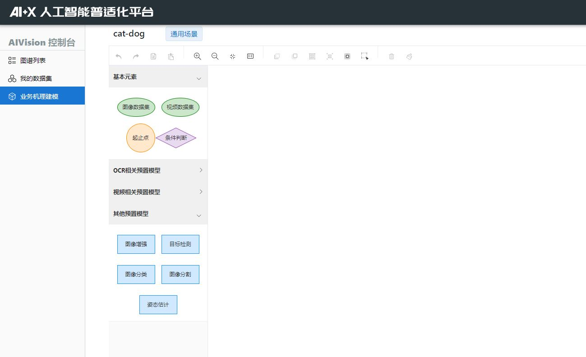

# AIVision 开发平台（AIP）使用文档

## 多阶段任务子平台

### 功能介绍

多阶段任务平台是涵盖了目标检测、图像分类等常见深度学习任务的在线实验平台，主要面向非深度学习背景和专业的用户。在平台上用户通过简单的绘制流程图的方式，确定并连接任务的各个节点，同时为每个节点选择合适的模型并配置参数，并通过平台提供的服务器快速创建并训练多阶段任务的模型（当然也支持一般的单阶段任务）。


该多阶段任务系统的核心思想是**每一个阶段都使用上一阶段产出的结果作为训练数据**，以此来模拟真实使用场景下的数据传递。

### 主要组件

- 数据集：上传及管理功能
- 子任务：单独的检测，分类等任务
- 流程图：即多阶段任务，包含个若干个子任务（如检测+分类）
- 模型：管理训练好的子任务模型

### 支持的子任务类型

- 图像分类
- 目标检测
- 文本识别
- 图像分割
- 文本检测
- 视频动作识别
- 图像增强类（image2image）：如图像去模糊，去褶皱，去印章，去阴影，去雨去雾等
- 自然语言处理相关任务： 规划

### 快速开始

以检测+分类为例：

#### 上传业务数据

提前上传好原始数据集，按规定格式打包成 zip 后，在数据集页面上传


##### 无标注的任务

无标注的任务只有图片

文件目录结构如下：

```
dataset_dir/
			1.jpg
			2.jpg
			...
```

_以下均为有标注的任务。_

##### 分类任务

在数据集目录下，每个目录名代表一种类别，该目录下的所有图片均为同类别(即目录名)

eg:类别包括 cat,dog,sheep

文件目录结构如下：

```
dataset_dir/
            cat/
                cat1.jpg
                cat2.jpg
                ...
            dog/
                dog1.jpg
                dog2.jpg
                ...
            sheep/
                sheep1.jpg
                sheep2.jpg
                ...
```

##### 目标检测（矩形）

文件目录结构如下：

```
dataset_dir/
			1.jpg
			2.jpg
			...
			label.txt
```

其中 label.txt 中的格式如下：

```
path,width,height
num
xmin,ymin,xmax,ymax
label/text
```

注：path 表示图片的相对路径，如：1.jpg

width,height 均为整数，表示图片的宽、高

num 表示有几个检测框，则下面就会有个成对的标注

xmin，ymin,xmax,ymax 表示检测框中的左上角以及右下角的坐标中横坐标及纵坐标的最大最小值。

label/text 表示检测框中的类别或者文本识别信息

eg:

```
1.jpg,100,200
3
1,1,10,10
cy
13，13，28，29
yc
30,40,50,60
cycycycy
2.jpg,200,250
1
2,3,19,23
text
....
```

##### 文本检测（矩形）

文件目录结构如下：

```
dataset_dir/
			1.jpg
			2.jpg
			...
			label.txt
```

其中 label.txt 中的格式如下：

```
path,width,height
num
xmin,ymin,xmax,ymax
label/text
```

注：path 表示图片的相对路径，如：1.jpg

width,height 均为整数，表示图片的宽、高

num 表示有几个检测框，则下面就会有个成对的标注

xmin，ymin,xmax,ymax 表示检测框中的左上角以及右下角的坐标中横坐标及纵坐标的最大最小值。

label/text 表示检测框中的类别或者文本识别信息

eg:

```
1.jpg,100,200
3
1,1,10,10
cy
13，13，28，29
yc
30,40,50,60
cycycycy
2.jpg,200,250
1
2,3,19,23
text
....
```

##### 文本检测(多边形)

文件夹格式同上

```
dataset_dir/
			1.jpg
			2.jpg
			...
			label.txt
```

label.txt 中格式与上类似，主要区别在于记录检测框的方式变成**顺时针**遍历的坐标，注意不需要首位坐标重复

```
path,width,height
num
(x1,y1),(x2,y2),(x3,y3),...(xn,yn)
label/text
```

##### 图像分割(多边形)

文件夹格式同上:

```
dataset_dir/
			1.jpg
			2.jpg
			...
			label.txt
```

label.txt 中格式与上类似，主要区别在于记录检测框的方式变成**顺时针**遍历的坐标，注意不需要首位坐标重复，**只需要给出前景物体的标注**

```
path,width,height
num
(x1,y1),(x2,y2),(x3,y3),...(xn,yn)
label/text
```

##### 文本识别

文件夹格式同上:

```
dataset_dir/
			1.jpg
			2.jpg
			...
			label.txt
```

其中 label.txt 中的格式如下：

```
path,text
```

eg:

```
1.jpg,cycyc
2.jpg,cycycyyc
```

##### 增强任务

文件夹格式如下：

其中确保 input 和 target 中的图片名称**一一对应**，并已经**分好训练集和测试集**。

```
dataset_dir/
            train/
                input/
                    a.jpg
                    b.jpg
                target/
                    a.jpg
                    b.jpg
            test/
                input/
                    c.jpg
                target/
                    c.jpg
```

上传完成后，在我的数据集中会看到该数据集


#### 快速定制任务

进入流程图模块，点击页面上的新建按钮，输入流程图名，即可新建流程图



绘制任务流程图，数据集节点需要连向第一个需要该数据集的任务节点，由于该任务是细粒度检测+识别，那么实际上针对粗类别 cat 和 dog，细分类任务模型需要分别训练，体现在流程图上就需要绘制两个图像分类节点


配置每个流程图节点的具体参数并上传

**配置数据集节点**：选择刚才上传的那个原始数据集，并点击右侧的保存属性


**配置目标检测任务节点**：点击右侧按钮打开任务配置界面，在选择模型后会出现详细参数的设置。如果第一次使用，那么选择重新训练，设置运行参数（默认也可），同时选择可选的预训练模型（加快训练速度），输入（细）类别（cat,dog）,设置公开属性，设置完成后如下图，点击下方保存


如果是第二次使用这个模型节点，并且目的相同，那么可以选择直接使用已经训练好的模型（如果第一步选择了公开，那么其他用户使用该模型训练的参数也会出现在备选列表中），这个节点不需要重新训练，但同时类别也不再允许更改


**配置图像分类任务节点**，与上一步类似，需要注意的是，目前创建的任务属于细粒度检测+识别，因此需要输入该细粒度识别模型对应的粗类别，比如 cat（**属于检测任务的一个细类别**），然后输入不同的 cat 细类别，在另一个分类节点中也一样


点击右上角下载参数可以下载本次设置的参数；**点击右上角的上传可以创建任务**

#### 自动串行训练

查看流程图任务状态，在已创建的流程图页面点击刚才创建的流程图可以进入到该流程图的状态页面


#### 本地一键部署

用户的流程图在训练完成后，进入【流程图】页面，选择【表格一览】标签，可以看到以表格形式呈现的所有流程图。点击【下载 AIP 通用镜像】可以下载已经配置好了所需环境的容器镜像，可用于后续所有本平台模型的本地部署。

对于训练好的流程图模型，点击右侧下载图标可以下载 zip 格式的压缩包到本地，参考下方的本地部署指令即可实现在本地运行一个 HTTP 服务。

下载解压后在本目录下运行./deploy.sh 1.x,稍等片刻即可通过宿主机 10086 端口访问服务，向<http://127.0.0.1:10086/aip>发送请求即可获得结果

**本地部署指令**

```bash
aaa
bbb
ccc
```

**本地 HTTP 调用方式**

POST /aip

\# request

```json
{
  "image": base64_str
}
```

| 字段名 | 字段类型 | 备注                                   |
| ------ | -------- | -------------------------------------- |
| image  | string   | base64 字符串表示的图像，大小不超过 4M |

\# response

```json
{
  "code": code,
  "message": message,
  "data": data,
  "time": time
}
```

| 字段名  | 字段类型 | 备注                                                                         |
| ------- | -------- | ---------------------------------------------------------------------------- |
| code    | number   | 200 表示预测成功，400 表示请求参数错误，401 表示预测过程发生错误，请联系支持 |
| message | string   | 信息                                                                         |
| data    | json     | json 格式的数据                                                              |
| time    | string   | 响应时间，如 `2020-12-21 20:26:41`                                           |

**curl**

```bash
curl -H "Content-Type: application/json" -X POST -d '{"image": "base64_str" }' "http://10.214.211.205:12345/aip"
```

**参考资料**

\# Python 将图片路径转为 base64 字符串

```python
import base64
def read_image(image_path):
    with open(image_path, "rb") as image_file:
        encoded_string = base64.b64encode( image_file.read() )
    return encoded_string.decode('utf-8')
```
