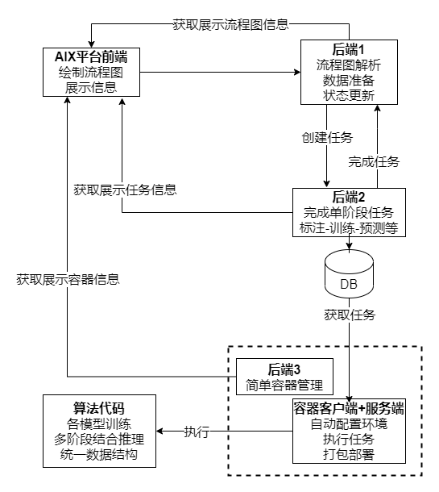

# 接口

## 结构



## 流程图 API

#### 创建流程图

```json

```

## 模型 PAI

#### 根据任务类型获取好多好多的信息

请求

> GET /xx

参数

```json
task_type: "segmentation"
```

响应：

```json
[
    {
        "id": 1,
        "model_name": "name",
        "task": "segmentation",
        "info": "",
        "has_pretrain": true/false,  pretrain_info.length != 0
        "code_id": 12,
		"input_size": "224×224",
        // code  根据code_id获取code信息
        "code_info": {
            "args": {},  // 不要字符串  ！
            "metrics": {} // 不要字符串  ！
        },
        // pretrained_weights 根据model_id获取【用户自己】创建的及【公开的】所有预训练权重
        "pretrain_info": [
            {
                "id": 1,
                "pretrain_name": "name",
                "file": "/nfs/xx/xx.pth",
                "info": "",
                "username": "zlz",
                "is_public": true,
                "categories": "1,2,3,4",
                "created_time": "2011-02-02",
                "metric": {a:1, }
            },
            ...
        ]
    },
    ...
]
```
